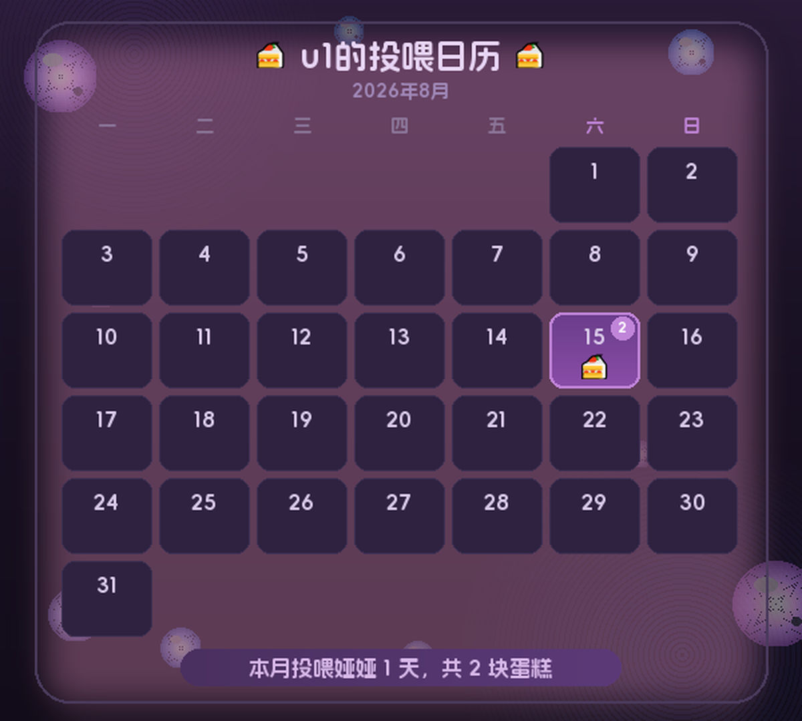

# astrbot_plugin_cake_denia

今天你喂娅娅小蛋糕了吗？发送 🍰（或「蛋糕」）就可以给鸣潮达妮娅（娅娅）喂一块小蛋糕！

一款为 [AstrBot](https://github.com/AstrBotDevs/AstrBot) 框架设计的趣味喂蛋糕插件。

## 功能

- 🍰 / 蛋糕 喂蛋糕（按完整触发词计数：`🍰🍰🍰` = 3 块、`蛋糕` = 1 块），娅娅随机回复 + 自动生成日历图
- 🎨 双人格随机回复：娅娅（日常学生版）为主，达妮娅（boss版）以 20% 概率作为彩蛋随机出现（与主题无关）
- 🍰 @某人 替别人喂蛋糕
- 🍰日历：查看娅娅本月日历（娅娅粉彩 / 达妮娅暗夜主题可选）
- 🍰报告 / 🍰分析 [月|年]：娅娅投喂分析报告
- 🍰生涯：投喂生涯档案
- 🍰补签 DD [次数]：补签某天
- 🍰榜 [页码]：排行榜（自己喂/被喂/替喂 × 今日/本月，含成就徽章）
- 🍰成就：查看成就墙
- 🍰重置榜单：管理员重置今日计数（可@他人）
- 🍰帮助：查看帮助

## 效果预览

## 安装

将插件目录 `astrbot_plugin_cake_denia` 放入 AstrBot 的 `data/plugins/`，在管理面板「插件管理」中启用；或将插件目录打包为 zip 后在「插件管理」页面上传安装。

## 使用

| 指令 | 说明 |
| --- | --- |
| `🍰` / `蛋糕` | 给娅娅喂一块小蛋糕（`🍰🍰🍰`=3 块，`蛋糕`=1 块，单条上限见配置） |
| `🍰 @某人` | 替某人喂蛋糕 |
| `🍰日历` | 查看娅娅本月日历 |
| `🍰报告` / `🍰分析 [MM\|YYYY]` | 本月/指定月份或年份投喂报告 |
| `🍰生涯` | 投喂生涯档案 |
| `🍰补签 DD [次数]` | 补签某天 |
| `🍰榜 [页码]` | 查看排行榜 |
| `🍰成就` | 查看成就墙 |
| `🍰重置榜单` | 管理员重置今日计数 |
| `🍰帮助` | 查看帮助 |

## 配置

管理面板「插件管理 → 插件名 → 配置」：

| 配置项 | 类型 | 默认值 | 说明 |
| --- | --- | --- | --- |
| trigger_words | list | ["🍰", "蛋糕"] | 触发词（命令关键词），可自定义；按完整触发词计数，如改 `["🍬","糖果"]` 则 `🍬🍬`=2 块、`糖果`=1 块 |
| group_whitelist | list | [] | 群白名单，不填全群可用 |
| user_blacklist | list | [] | 用户黑名单 |
| day_start_time | string | 00:00 | 每天开始时间 |
| auto_delete_last_month_data | bool | false | 自动清理两个月前及更早的投喂记录（注意：不是删上月）。默认关闭以保留历史，生涯/年度报告需要历史数据 |
| daily_max_checkins | int | 0 | 每日最多喂蛋糕次数（每条消息算 1 次，含帮喂/补签），超出随机提示娅娅吃不下 |
| max_cakes_per_message | int | 3 | 单条消息最多喂蛋糕数，超出提示娅娅吃不下 |
| ranking_display_count | int | 10 | 排行每页人数 |
| llm_enabled | bool | true | LLM 对话总开关 |
| llm_trigger_probability | float | 0.3 | LLM 触发概率 |
| llm_daily_min_cakes | int | 3 | 当日喂满几块才可触发 LLM |
| llm_daily_limit | int | 5 | 全群每日 LLM 触发上限 |
| auto_download_font | bool | true | resources/fonts 无字体时自动下载默认字体（阿里妈妈方圆体 + emoji），失败回退系统字体 |
| font_download_url | string | GitHub Releases | 中文字体下载地址，自备字体时填自己的链接，留空用默认 |
| emoji_download_url | string | GitHub Releases | emoji 字体下载地址，Windows 系统自带 emoji 字体可不填 |
| render_backend | string | pil | 日历渲染后端：`pil`（无额外依赖）或 `html`（HTML/CSS + Playwright + 系统 Chrome，效果与设计稿一致，失败自动降级 pil） |
| theme_preset | string | white-1 | 日历主题：`white-1`（娅娅·泡泡初绽，默认）/ `white-2`（娅娅·马卡龙双层）/ `black-1`（达妮娅·暗夜泡泡）/ `black-2`（达妮娅·阿列夫之眼）/ `custom`（resources/theme.json 自定义） |

> 达妮娅（暗夜）是**彩蛋**：无论 `theme_preset` 选什么主题，喂蛋糕回复都有 20% 概率以「达妮娅」（boss版）口吻出现，且**当日历图同时生成时，那张日历也会用达妮娅暗夜主题（black-1）渲染**。触发达妮娅彩蛋时，该条回复**不会触发 LLM 对话**。想关掉彩蛋，把 `resources/texts.py` 里的 `BLACK_*` 列表清空即可。

## 依赖

无第三方依赖（AstrBot 自带 aiosqlite 与 Pillow）。

## 资源文件夹 `resources/`

- `resources/texts.py`：娅娅文案集中文件。**随机回复池**（喂蛋糕/帮喂/吃不下/每日超限）与**双人格文案**（娅娅 + 达妮娅彩蛋各一组）都在这里，改文案只改这一个文件（改完重载插件生效）
- `resources/fonts/font.ttf`：中文字体。**插件包不携带字体**（体积大），需自行下载放入；未放入时会自动尝试系统字体（微软雅黑/思源黑体/Noto Sans CJK），全部缺失时图片生成降级为文字回复，打卡计数不受影响。下载指引见 [resources/README.md](resources/README.md)

更多自定义（成就/主题/触发词）见 [resources/DIY.md](resources/DIY.md)。
